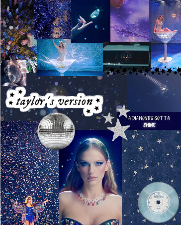

# 🎵 Taylor Swift - Midnights (Exclusive Album Cover)

## 👩‍💻 Membres du binôme
- Alyssia LORSOLD PRADON
- Léora CHRIQUI

## 🚀 Instructions pour lancer le projet
1. Cloner ou télécharger le dépôt.
2. Ouvrir le dossier dans [Visual Studio Code](https://code.visualstudio.com/).
3. Ouvrir le fichier `index.html` dans votre navigateur

> ⚠️ Aucun build ou dépendance : le projet utilise uniquement **HTML, CSS, JS**.

---

## 🖼️ Moodboard

---

## 💡 Concept artistique

L’album *Midnights* de **Taylor Swift** est un projet conceptuel centré sur **treize nuits d’insomnie**, à travers lesquelles l’artiste explore des thèmes profonds comme la **haine de soi**, les **fantasmes de vengeance**, les **souvenirs douloureux**, et l’**amour fragile**. L’univers visuel de l’album original reflète cette introspection : une pochette **neutre**, **minimaliste**, presque silencieuse, à l’image de ces moments suspendus où l’on rumine seul dans le noir.

Mais certains clips de l’album – comme *Bejeweled* ou *Lavender Haze* – détonnent par leur **esthétique brillante, cosmique et féérique** : des paillettes, des lumières colorées, des ambiances quasi oniriques.  
Nous avons choisi de nous inspirer de cette **face plus visuelle, légère et "bling-bling"** de *Midnights*, pour créer une **pochette exclusive et animée**.

Notre version cherche à exprimer une autre facette de ces nuits sans sommeil : **celle de l’évasion mentale**, du rêve éveillé, voire de la **reconstruction** à travers l’imaginaire.  
Les étoiles scintillantes en arrière-plan symbolisent cette **quête d’espoir**, de lumière au cœur de la nuit. Elles traduisent aussi la part de **résilience et de magie** que l’on retrouve dans les morceaux plus lumineux de l’album (*Bejeweled*, *Karma*, *Paris*...).

C’est donc une proposition créative et personnelle, comme si l’album *Midnights* avait eu une **édition spéciale "céleste"**, dédiée aux moments où l’on choisit de **briller malgré l’obscurité**.

---

## 🌐 Projet en ligne

🔗 [Voir la version en ligne](https://creative-development-orpin.vercel.app/)

---

